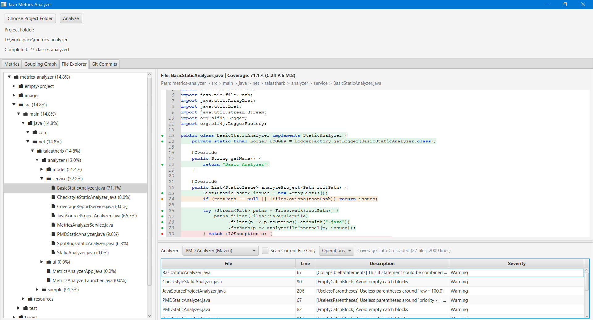
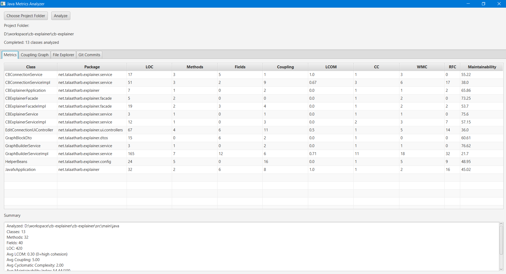
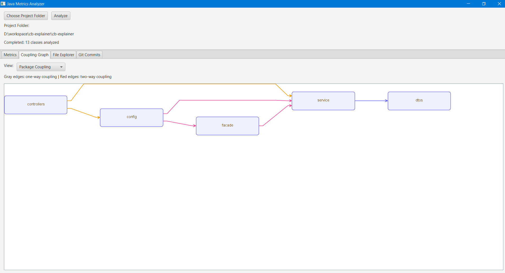
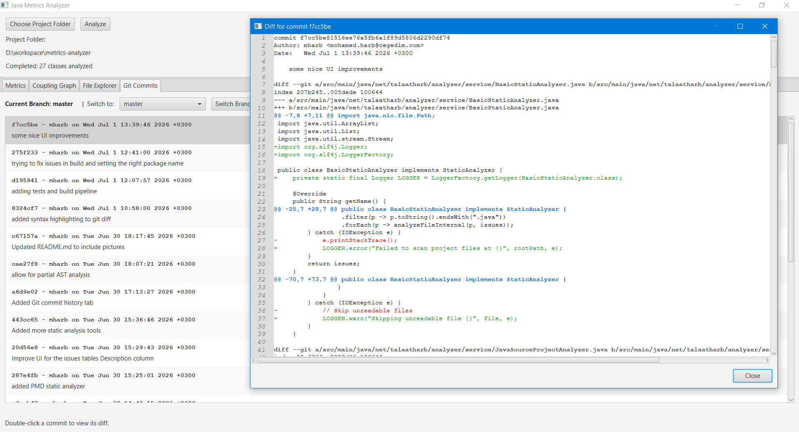

# metrics-analyzer
Sample code for code metrics analysis.

This application is a Java Source Project Analyzer built using [Spoon](https://spoon.gforge.inria.fr/). It parses Java source code to compute object-oriented code metrics at the class level and extracts dependency relationships (class-level and package-level couplings).

## Calculated Metrics and Formulas

* **Lines of Code (LOC)**: Total number of lines in a class.
* **Method Count**: Number of methods declared in a class.
* **Field Count**: Number of fields declared in a class.
* **Efferent Coupling (Ce)**: The number of unique non-JDK types the class depends on.
* **Lack of Cohesion of Methods (LCOM)**: Calculates the ratio of disjoint method pairs to total method pairs.
  * *Formula*: `LCOM = disjointPairs / totalPairs` (where disjoint pairs are non-static methods that do not access any common fields).
* **Cyclomatic Complexity (CC)**: The total number of decision points across all methods in a class.
  * *Formula*: `CC = max(1, total decision points)` (decision points include `if`, `else if`, `for`, `while`, `switch`, `catch`, `&&`, `||`, `?:`).
* **Weighted Methods Per Class (WMC)**: The sum of complexities of all methods.
  * *Formula*: `WMC = Σ (decision points of method + 1)` for all methods.
* **Response for Class (RFC)**: The number of unique method calls invoked by all methods within the class.
* **Maintainability Index (MI)**: Indicates the maintainability of the class.
  * *Halstead Volume (V)* = `(total operators + total operands) * log2(distinct operators + distinct operands)`
  * *Raw MI* = `171.0 - 5.2 * ln(max(V, 1.0)) - 0.23 * CC - 16.2 * ln(max(LOC, 1))`
  * *Normalized MI* = `max(0, min(100, (Raw MI * 100.0) / 171.0))`

## How to Build

Ensure you have Java 11 or higher and Maven installed. Run the following command in the project root:

```bash
mvn clean package
```

## How to Run

To start the graphical user interface (JavaFX), run:

```bash
mvn javafx:run
```

Alternatively, to run the CLI analyzer directly:

```bash
mvn exec:java -Dexec.mainClass="net.talaatharb.analyzer.service.JavaSourceProjectAnalyzer" -Dexec.args="<path-to-project>"
```

## Coverage Visualization (File Explorer)

In the **File Explorer** tab, use **Generate Coverage** to run tests and generate coverage reports, then visualize line coverage directly in the editor gutter and line background.

Supported report sources:
- **JaCoCo** (`target/site/jacoco/jacoco.xml` or `target/site/jacoco-aggregate/jacoco.xml`)
- **Cobertura** (`target/site/cobertura/coverage.xml` or `target/coverage.xml`)

## Screenshots

### Project Explorer & Static Analysis


### Metrics


### Coupling


### Git Commits

